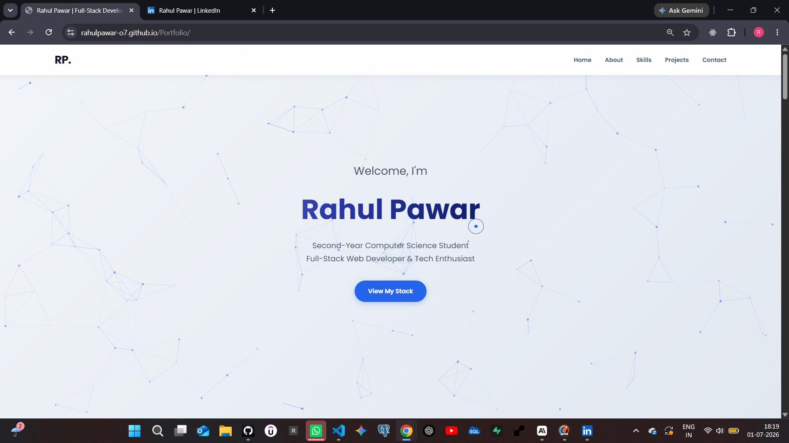
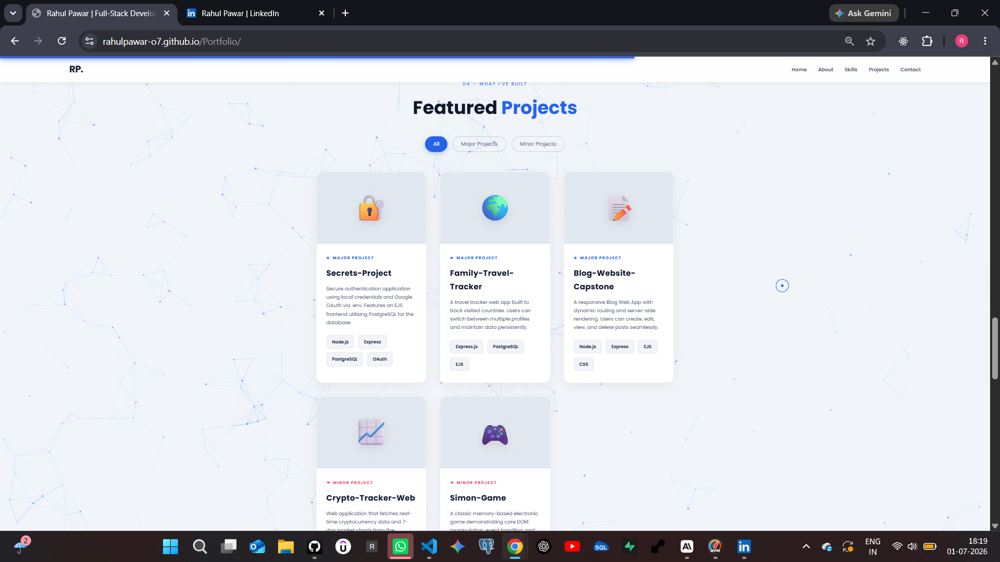
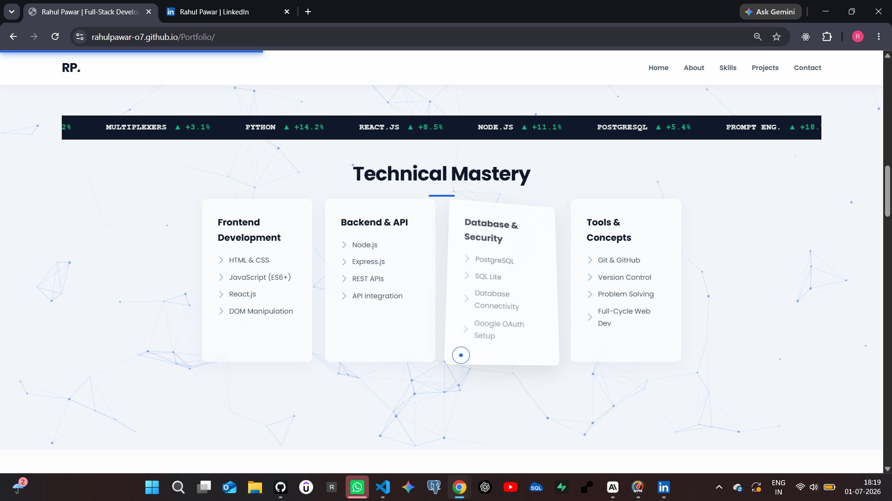
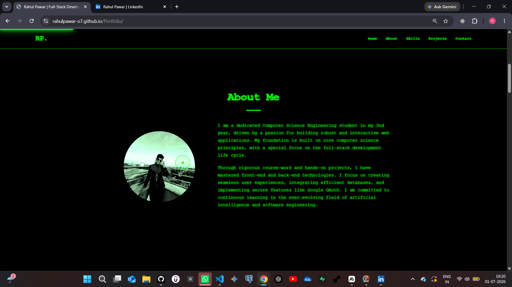

# 🚀 Rahul Pawar — Portfolio Website

A personal developer portfolio website showcasing my skills, projects, and experience as a Full-Stack Web Developer and Computer Science student.

## 🌐 Live Demo
[View Portfolio](https://rahulpawar-o7.github.io/Portfolio/) <!-- Replace with your actual deployed link -->

---

## ✨ Features & What Happens Behind the Scenes

### 🖱️ Magic Trailing Cursor
A custom cursor activates on mouse movement — a small dot follows the cursor precisely, while a larger outline ring trails behind with a smooth animation delay. When the cursor hovers over any button, link, or image, the outline ring automatically scales up.

### 📜 Neon Scroll Progress Bar
A glowing neon progress bar at the top of the page tracks how much of the page has been scrolled in real time.

### 💻 Interactive Terminal (Backend Mindset Section)
When the terminal section enters the viewport (detected via `IntersectionObserver`), an auto-typing animation begins, simulating a developer environment startup:
```
Initializing sequence...
Loading React components... 100%
Connecting to PostgreSQL database... Success
Running Express.js server on port 3000...
Access Granted: Full-Stack Developer Mode Engaged.
```
Once the auto-typing finishes, a live input box unlocks. Users can type the following commands:

| Command | Output |
|---------|--------|
| `help` | Lists all available commands |
| `about` | Short intro about Rahul |
| `skills` | Full tech stack — Frontend, Backend, Database |
| `contact` | Displays email address |
| `clear` | Clears the terminal output |
| anything else | `bash: command not found` error |

### 🥚 Easter Egg — Hacker Mode
Click the profile photo **3 times** and the entire website switches to a secret **Hacker Mode** theme! All 3 clicks must happen within 3 seconds, otherwise the counter resets automatically.

### 🗂️ Project Filter
The Projects section includes three filter buttons:
- **All** — Shows every project
- **Major Projects** — Displays only major projects
- **Minor Projects** — Displays only minor projects

Cards appear and disappear with a smooth `fadeInUp` animation on every filter change.

### 📊 Live GitHub Stats (REST API)
The `/live-stats` section fetches real-time data directly from the GitHub REST API:
- 📁 **Public Repos** — Total public repository count
- 👥 **Followers** — Current follower count

API Endpoint: `https://api.github.com/users/rahulpawar-o7`

### 🌌 Particle Backgrounds
Animated particle network backgrounds powered by `particles.js` across 3 sections:
- Hero Section
- Skills Section
- Projects Section

**Hover** over particles to draw connecting lines. **Click** anywhere to spawn new particles.

### 🃏 3D Tilt Cards
Project cards, skill boxes, and stat boxes tilt in 3D on hover using `Vanilla Tilt.js`, complete with a glare effect.

### 🔢 Auto Year in Footer
The copyright year in the footer is automatically set using `new Date().getFullYear()` — no manual updates needed.

---

## 🛠️ Tech Stack

| Layer | Technology |
|-------|-----------|
| Markup | HTML5 |
| Styling | CSS3 |
| Logic | Vanilla JavaScript (ES6+) |
| Animations | AOS (Animate On Scroll) |
| Particles | Particles.js |
| 3D Effects | Vanilla Tilt.js |
| Icons | LinearIcons |
| Fonts | Google Fonts (Poppins) |
| Data | GitHub REST API |

---

## 📁 Project Structure

```
portfolio/
├── index.html        # Main HTML structure
├── style.css         # All styles + hacker mode theme
├── index.js          # JS logic (cursor, terminal, GitHub API, particles, filter)
├── my_photo3.jpeg    # Profile photo (click 3 times for a surprise 🤫)
└── screenshots/      # Portfolio screenshots
```

---

## 🔧 Setup & Run Locally

1. Clone the repository
```bash
git clone https://github.com/rahulpawar-o7/your-portfolio-repo.git
cd your-portfolio-repo
```

2. Open in browser
```bash
# Recommended: Open with Live Server extension in VS Code
# Or simply open index.html directly in any browser
```

> ⚡ No build tools or npm required — this is a pure HTML/CSS/JS project.

---

## 📌 Sections Overview

| # | Section | Description |
|---|---------|-------------|
| 01 | Home | Hero section with particles background |
| 02 | About | Bio with profile photo easter egg |
| 03 | Skills | Skill grid with live ticker banner |
| 04 | Backend Mindset | Auto-typing interactive terminal |
| 05 | Projects | Filterable project cards with 3D tilt |
| 06 | GitHub Stats | Live API-fetched stats |
| 07 | Contact | LinkedIn & GitHub links |

---

## 💼 Projects Showcased

- 🔐 **Secrets-Project** — Node.js authentication app with local credentials and Google OAuth 2.0
- 🌍 **Family-Travel-Tracker** — Multi-profile country tracker with persistent PostgreSQL storage
- 📝 **Blog-Website-Capstone** — Full CRUD blog with server-side rendering using EJS
- 📈 **Crypto-Tracker-Web** — Real-time cryptocurrency data via CoinGecko API using Axios
- 🎮 **Simon-Game** — Classic memory game built with DOM manipulation and event handling

---

## 📸 Screenshots

<!-- Add images to the screenshots/ folder and update paths below -->
## HOME SECTION

## PROJECTS SECTION

## SKILLS SECTION

## HACKER MODE


---

## 👤 Author

**Rahul Pawar**
- GitHub: [@rahulpawar-o7](https://github.com/rahulpawar-o7)
- LinkedIn: [Rahul Pawar](www.linkedin.com/in/rahul-pawar-a09404358)

---

> *"Building the web, one commit at a time."*
